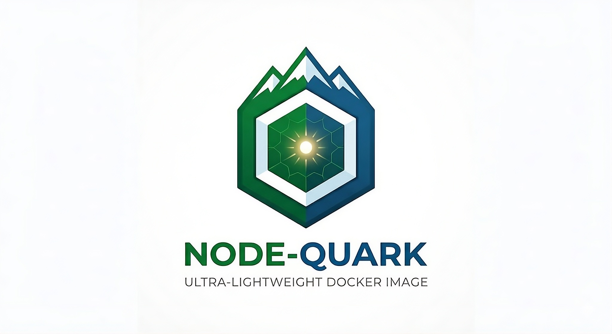

<h1 style="display: flex; align-items: center; gap: 10px;">
    <picture>
        <source srcset="./assets/node-quark-logo.png" width="50px">
        
    </picture>
    <span>Node Quark</span>
</h1>

<p align="center">
  <a href="https://github.com/xutyxd/node-quark">
    <picture>
      <source srcset="./assets/node-quark-banner.jpeg" width="50%">
      
    </picture>
  </a>
</p>

<center>

[-critical?logo=linux&logoColor=white)](Dockerfile)
[](https://hub.docker.com/r/xutyxd/node-quark)
[](https://hub.docker.com/r/xutyxd/node-quark)
[](Dockerfile)

[](https://nodejs.org/)
[](Dockerfile)

[](https://github.com/xutyxd/node-quark/actions)
[-9cf?logo=sigstore&logoColor=white)](https://github.com/xutyxd/node-quark#-verifying-image-signatures)


</center>

> **Ultra-minimal, multi-architecture Node.js containers built from scratch**

Node-Quark delivers secure, distroless Node.js Docker images based on `scratch` rather than full Linux distributions. By dynamically extracting only the essential libraries required by Node.js from Alpine Linux, we achieve images that are **~35MB** (compared to ~180MB+ for standard Alpine Node images) while maintaining full HTTPS, crypto, and ICU (internationalization) support.

## ✨ Features

- **🪶 Minimal Attack Surface**: Based on `scratch` (empty image), not Alpine or Debian
- **📦 Dynamic Dependency Extraction**: Automatically detects and bundles only required libraries using `ldd`
- **🏗️ Multi-Architecture**: Native support for `linux/amd64` and `linux/arm64/v8` (Apple Silicon, AWS Graviton, Raspberry Pi)
- **🔒 Security Hardened**: Non-root user (`uid:1000`), no shell, no package manager, minimal filesystem
- **🏷️ Semantic Tagging**: Automatic version extraction and multi-tag strategy (major, minor, patch)
- **🔄 Multi-Version Support**: Node.js 20 (LTS), 22 (LTS), and Edge (latest development)
- **🗜️ Compression**: UPX compression support for even smaller binaries (trade-off: startup time)

## 🏃 Quick Start

```bash
# Pull the latest LTS version (Node 22)
docker pull xutyxd/node-quark:22

# Run a quick test
docker run --rm xutyxd/node-quark:22 -e "console.log('Hello from scratch!')"

# Check the size (should be ~60MB vs 180MB+ for node:22-alpine)
docker images xutyxd/node-quark:22

# Multi-arch support (automatically selects correct platform)
docker run --rm xutyxd/node-quark:22 -p "process.arch"
```

## Available Tags
| Tag                                            | Node Version      | Alpine Base | Size  | Platform     |
| ---------------------------------------------- | ----------------- | ----------- | ----- | ------------ |
| `20`, `20.15`, `20.15.1`, `20.15.1-alpine3.20` | 20.x              | 3.20        |  | amd64, arm64 |
| `22`, `22.22`, `22.22.2`, `22.22.2-alpine3.22`, `latests` | 22.x              | 3.22        |  | amd64, arm64 |
| `edge`, `24-edge`                              | 24.x (dev)        | edge        |  | amd64, arm64 |

## 🏗️ Architecture

*How It Works*

Traditional Node.js images include a full OS (Alpine, Debian, etc.) with shells, package managers, and hundreds of unused files. Node-Quark takes a different approach:

```
┌─────────────────────────────────────────────┐
│  Stage 1: Builder (Alpine Linux)            │
│  ├── Install Node.js from Alpine repos      │
│  ├── Install UPX                            │
│  ├── Run `ldd /usr/bin/node`                │
│  ├── Extract all linked libraries           │
│  └── Copy to /rootfs structure              │
└──────────────────┬──────────────────────────┘
                   │
                   ▼
┌─────────────────────────────────────────────┐
│  Stage 2: Runner (Scratch)                  │
│  ├── Copy /rootfs (Node + libs only)        │
│  ├── CA certificates for HTTPS              │
│  ├── Non-root user (1000:1000)              │
│  └── No shell, no package manager           │
└─────────────────────────────────────────────┘
```

**Dynamic Dependency Extraction**

Unlike other distroless images that hardcode library paths (which break when Node.js updates), we use `ldd` to automatically detect the exact libraries needed:

```
# Capture every library Node.js links against
ldd /usr/bin/node | grep -o '/[^ ]*' | sort -u > /tmp/libs.txt

# Copy each library while preserving directory structure
while IFS= read -r lib; do
    cp -L "$lib" "/rootfs$lib"
done < /tmp/libs.txt
```

This ensures compatibility across Alpine versions (**3.20**, **3.22**, **edge**) without manual updates when dependencies change.

**Security Features**

- **Non-root execution**: Runs as `node` (uid `1000`), not root
- **Read-only filesystem**: No write permissions except /tmp (if mounted)
- **No shell access**: scratch images have no /bin/sh
- **Minimal libraries**: Only musl libc, OpenSSL, ICU, and compression libs
- **CA certificates**: Bundled Mozilla CA bundle for HTTPS verification

## 🛠️ Usage in Your Projects

**Dockerfile integration**  
Node-Quark is designed to be used as runner in your Dockerfiles. It's a good idea to use a multi-stage build to reduce the size of your final image.
```Dockerfile
# Use node:alpine as base
# It has npm, bash, and other utilities
FROM alpine AS builder
# Download and install Node.js
RUN apk add --no-cache nodejs npm

WORKDIR /user/src/app

ADD . .

RUN npm install
RUN npm run openapi:bundle
RUN npm run server:build
RUN npm run clean

# --------
FROM alpine:3.22 AS tools

RUN mkdir -p /usr/src/app && \
    chown -R 1000:1000 /usr/src/app

# --------

FROM xutyxd/node-quark:22 AS runner

COPY --from=tools /usr/src/app /usr/src/app

WORKDIR /usr/src/app

COPY --from=builder /user/src/app/server/cjs /user/src/app/server/cjs
COPY --from=builder /user/src/app/server/openapi /user/src/app/server/openapi
COPY --from=builder /user/src/app/package.json /user/src/app/package.json
COPY --from=builder /user/src/app/node_modules /user/src/app/node_modules
# As ENTRYPOINT is directly /bin/node, only need to point to the main file
CMD ["./server/cjs/index.js"]

EXPOSE 8080
```

## 📊 Size Comparison
| Image                    | Size      | Base            | Security                   |
| ------------------------ | --------- | --------------- | -------------------------- |
| `node:22`                | ~1.1GB    | Debian Bookworm | Many CVEs                  |
| `node:22-alpine`         | ~180MB    | Alpine 3.21     | Minimal CVEs               |
| `node:22-slim`           | ~250MB    | Debian Slim     | Medium CVEs                |
| **xutyxd/node-quark:22** |  | **Scratch**     | **Minimal attack surface** |

## 🔐 Verifying Image Signatures

All published images are signed using [Sigstore Cosign](https://www.sigstore.dev/) with keyless signing via GitHub Actions OIDC. You can verify the provenance and SBOM without installing anything except Docker.

### Verify image attestation (includes SBOM)

```bash
docker run --rm \
  ghcr.io/sigstore/cosign/cosign:v2.4.1 \
  verify-attestation \
  --certificate-identity=https://github.com/xutyxd/node-quark/.github/workflows/docker.yml@refs/heads/main \
  --certificate-oidc-issuer=https://token.actions.githubusercontent.com \
  --type spdx \
  xutyxd/node-quark:22
```


## 🚨 Known Limitations

 - **No Native Compilation**: If your app requires node-gyp or native modules, build them in a separate stage with node:alpine and copy the compiled .node files.  
 - **No npm install in Runner**: The scratch image includes npm but no git, python, or build tools. Install dependencies in a builder stage.
 - **File Watching**: fs.watch may behave differently without inotify (some fallbacks to polling).

## 🙏 Acknowledgments
 - Inspired by Google Distroless but with dynamic dependency resolution
 - Built on Alpine Linux for the builder stage
    - **Jakub Jirutka** ([@jirutka](https://github.com/jirutka)) Node.js Alpine Builder
 - Compression is provided by [UPX](https://github.com/upx/upx)
 - Node.js is a trademark of the OpenJS Foundation